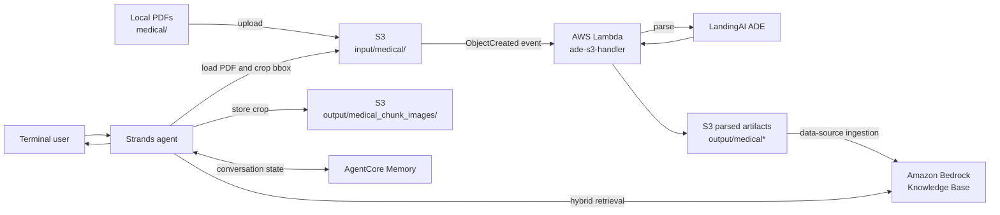

# Research Paper Chatbot

An experimental retrieval-augmented chatbot for asking questions about PDF research and medical documents. The project combines LandingAI's Agentic Document Extraction (ADE), Amazon S3, an Amazon Bedrock Knowledge Base, a Strands agent, and Amazon Bedrock AgentCore Memory. Retrieved passages retain page and bounding-box metadata, allowing the chatbot to link to a cropped image of the source region.

This repository is based on **Lab 6: Building a Research Paper Chatbot with Strands Agents** from DeepLearning.AI's *Document AI: From OCR to Agentic Doc Extraction* course.

> [!WARNING]
> `main.py` is both an infrastructure/deployment script and an interactive application. Running it creates or updates AWS resources, replaces the target S3 bucket's Lambda notification configuration, uploads local PDFs, starts a Knowledge Base ingestion job, and may create an AgentCore memory. Review the [side effects](#what-running-mainpy-changes) and [known limitations](#known-limitations) before running it against an existing AWS account or bucket.

## What it does

1. Builds a Lambda deployment ZIP containing the ADE S3 handler and its Lambda-only dependencies.
2. Creates or reuses an IAM execution role and deploys the `ade-s3-handler` Lambda function.
3. Configures the S3 bucket to invoke the Lambda for objects created under `input/`.
4. Uploads PDFs from the local `medical/` directory to `s3://<bucket>/input/medical/`.
5. The Lambda sends each PDF to LandingAI ADE and writes parsed Markdown, full visual-grounding metadata, and one JSON document per extracted chunk.
6. Starts an ingestion job for an existing Amazon Bedrock Knowledge Base data source.
7. Creates a Strands agent that searches the Knowledge Base with hybrid retrieval.
8. When chunk metadata is available, crops the matching PDF region, stores the PNG in S3, and returns a one-hour pre-signed URL with the answer.
9. Connects the agent to AgentCore Memory when memory setup succeeds, then opens an interactive terminal chat.

## Architecture



## S3 object layout

For an uploaded file named `paper.pdf`, the normal layout is:

```text
input/
└── medical/
    └── paper.pdf

output/
├── medical/
│   └── paper.md
├── medical_grounding/
│   └── paper_grounding.json
├── medical_chunks/
│   ├── paper_<chunk-id-1>.json
│   └── paper_<chunk-id-2>.json
└── medical_chunk_images/
    └── paper_<chunk-id>.png
```

The Knowledge Base data source should ingest the individual JSON files under `output/medical_chunks/`. The retrieval code assumes that chunk results retain their S3 locations.

## Repository layout

```text
.
├── main.py                     # Deployment workflow, ingestion, retrieval tool, and chat loop
├── ade_s3_handler.py           # S3-triggered LandingAI ADE Lambda handler
├── lambda_helpers.py           # Lambda packaging/deployment, S3 upload, and monitoring helpers
├── visual_grounding_helper.py  # PDF rendering, cropping, annotation, and S3 image helpers
├── requirements.txt            # Local Python dependencies currently recorded by the project
└── README.md
```

## Prerequisites

- Python 3.10 or newer. The deployed Lambda runtime is currently fixed to Python 3.10.
- `pip` and the `zip` command available on your PATH.
- An AWS account and an S3 bucket in the same region as the other AWS resources.
- An existing Amazon Bedrock Knowledge Base and S3 data source.
- Access to the Bedrock model identified by `BEDROCK_MODEL_ID`.
- Amazon Bedrock AgentCore Memory availability in the selected region if conversational memory is desired.
- A LandingAI VisionAgent/ADE API key.
- AWS credentials authorized to manage the resources described below.

### AWS permissions

The principal running `main.py` needs, at minimum, permissions for the APIs it calls:

- IAM: create/get a role and attach managed role policies.
- Lambda: create/update/get the function and add invocation permission.
- S3: read, write, list, inspect objects, and update bucket notifications.
- Bedrock: list Knowledge Bases and data sources, start ingestion, retrieve results, and invoke the configured model.
- AgentCore Memory: list and create memories and use memory sessions.
- CloudWatch Logs access only if the optional monitoring helper is enabled.

The generated Lambda role is named `lambda-ade-exec-role`. The helper attaches `AWSLambdaBasicExecutionRole` and `AmazonS3FullAccess` to it. Tighten this to bucket-scoped access before using the project beyond a lab environment.

## Setup

### 1. Create a virtual environment

```bash
python3.10 -m venv .venv
source .venv/bin/activate
python -m pip install --upgrade pip
python -m pip install -r requirements.txt
```

`main.py` also imports the AgentCore SDK. If it is not already present in your environment, install it explicitly:

```bash
python -m pip install bedrock-agentcore
```

The Lambda builder installs `landingai-ade` and `typing-extensions` into the deployment ZIP automatically; they do not need to be installed locally for the chat process.

### 2. Configure the environment

Create a `.env` file in the repository root:

```dotenv
AWS_ACCESS_KEY_ID=your-access-key-id
AWS_SECRET_ACCESS_KEY=your-secret-access-key
AWS_REGION=us-west-2

S3_BUCKET=your-document-bucket
VISION_AGENT_API_KEY=your-landingai-api-key

BEDROCK_KB_ID=your-knowledge-base-id
DATA_SOURCE_ID=your-data-source-id
BEDROCK_MODEL_ID=your-bedrock-model-id
```

All eight values are used by the current workflow. Do not commit `.env` or credentials to version control.

The script passes the access-key values directly to Boto3 and has no `AWS_SESSION_TOKEN` setting. The example therefore assumes long-lived credentials; temporary credentials would require a small session-construction change.

### 3. Configure the Bedrock Knowledge Base

Create the Knowledge Base and its S3 data source before running the application, then put their IDs in `.env`. Configure the data source to include:

```text
s3://<S3_BUCKET>/output/medical_chunks/
```

The exact vector store, embedding model, parsing, and chunking choices are external to this repository. Because ADE already emits one JSON object per semantic chunk, avoid a configuration that needlessly combines unrelated chunk files.

### 4. Add source PDFs

Create the expected local folder and copy PDFs into it:

```bash
mkdir -p medical
cp /path/to/papers/*.pdf medical/
```

Only `.pdf` files are uploaded. Existing S3 objects are skipped by default.

## Run

```bash
python main.py
```

On startup the script deploys the ingestion infrastructure, uploads documents, lists available Knowledge Bases and their data sources, starts the configured ingestion job, runs a test query for `common cold symptoms`, initializes memory, and opens the `You:` prompt.

Ask a question about the uploaded documents. End the session with `exit`, `quit`, `bye`, or `q`.

### Processing timing

PDF parsing and Knowledge Base ingestion are asynchronous. The current script does not wait for the Lambda jobs to finish before starting ingestion, and it does not wait for ingestion to finish before running the test query. For the first run, confirm that Markdown and chunk JSON files exist in S3, then rerun `main.py` or manually start another data-source sync before judging retrieval results.

## What running `main.py` changes

Each run can perform the following mutations:

- Creates `ade_package/` temporarily and writes `ade_lambda.zip` locally.
- Creates or reuses the `lambda-ade-exec-role` IAM role.
- Creates or updates the `ade-s3-handler` Lambda function.
- Grants the S3 bucket permission to invoke that function.
- **Replaces all existing Lambda notification configurations on the bucket** with one `input/` trigger.
- Uploads previously absent PDFs from `medical/`.
- Starts a Bedrock Knowledge Base ingestion job.
- Creates an AgentCore memory when no matching `MedicalAgentMemory` is found.
- Creates cropped PNGs in S3 as retrieval results are used.

AWS, Bedrock model, vector-store, LandingAI, S3, Lambda, and AgentCore usage may incur charges.

## Configuration currently fixed in code

These values are not environment-driven yet:

- Local input directory: `medical/`.
- Lambda name: `ade-s3-handler`.
- IAM role name: `lambda-ade-exec-role`.
- Lambda runtime: `python3.10`.
- Lambda timeout: 900 seconds.
- Lambda memory: 1024 MB.
- ADE model: `dpt-2-latest`.
- Retrieval result count: 5.
- Retrieval mode: `HYBRID`.
- Source-PDF lookup: `input/medical/<source_document>.pdf`.
- Cropped-image prefix: `output/medical_chunk_images/`.
- Pre-signed image URL lifetime: one hour.

Change the corresponding constants in `main.py` and `visual_grounding_helper.py` if you use a collection name other than `medical`.

## Troubleshooting

### The test query returns no documents

- Confirm that the Lambda produced files under `output/medical_chunks/`.
- Confirm that the Bedrock data source points to that prefix.
- Wait for the data-source ingestion job to complete, then run the application again.
- Verify that `BEDROCK_KB_ID`, `DATA_SOURCE_ID`, and `AWS_REGION` refer to the same deployment.
- Confirm that the Knowledge Base supports the requested `HYBRID` search override.

### Answers have no cropped image

- Verify that the retrieved object is an ADE chunk JSON file whose S3 URI contains `chunks`.
- Confirm that its `source_document`, `page`, and normalized `bbox` fields are populated.
- Confirm that the original PDF exists at `input/medical/<source_document>.pdf`.
- Ensure the caller can read the PDF and write to `output/medical_chunk_images/`.
- Check that page numbering emitted by ADE matches the zero-based page indexing used by `extract_chunk_image`.

### Lambda deployment fails

- Confirm that `zip` is installed.
- Build the package in a Linux-compatible environment if a dependency contains native binaries; Lambda runs on Amazon Linux.
- Check the 900-second timeout against your account limits.
- Inspect the Lambda logs in `/aws/lambda/ade-s3-handler`.

### Memory is unavailable

The script catches AgentCore memory creation failures and continues without a session manager. Check regional availability, IAM permissions, and the AgentCore SDK configuration. The chat can still run without memory.

## Known limitations

- `ade_s3_handler.ade_handler` currently accepts only `event`; a standard Python Lambda handler is normally invoked with `(event, context)`. If Lambda reports a positional-argument error, update the signature before deployment.
- `requirements.txt` does not currently declare `bedrock-agentcore`, although `main.py` imports it.
- The deployment, ingestion, test query, and interactive application are executed at module import time rather than exposed as separate commands.
- The pipeline does not poll Lambda completion or Bedrock ingestion status.
- The S3 notification helper overwrites other Lambda notification rules on the bucket.
- The IAM helper uses the broad `AmazonS3FullAccess` managed policy.
- Existing PDFs and existing parsed outputs are skipped, so changing parsing settings does not automatically reprocess them. `FORCE_REPROCESS` is set to `false` in the deployed Lambda environment.
- Visual retrieval paths are specialized for the `medical` collection even though the Lambda handler itself preserves arbitrary subfolders.
- The memory actor ID is time-based, so user preference continuity across separate executions may not behave like a stable user identity.
- Pre-signed image URLs expire after one hour.
- This is a course-derived experimental project, not a production medical system. It must not be treated as medical advice or used for diagnosis or treatment decisions.

## Development notes

There is currently no automated test suite or lint configuration. A useful next refactor would separate the workflow into explicit commands such as `deploy`, `upload`, `ingest`, and `chat`, then add mocked unit tests for S3 event handling, chunk metadata conversion, and bounding-box cropping.

## Acknowledgements

- DeepLearning.AI — *Document AI: From OCR to Agentic Doc Extraction*
- LandingAI Agentic Document Extraction
- AWS Lambda, Amazon S3, Amazon Bedrock Knowledge Bases, and AgentCore Memory
- Strands Agents
